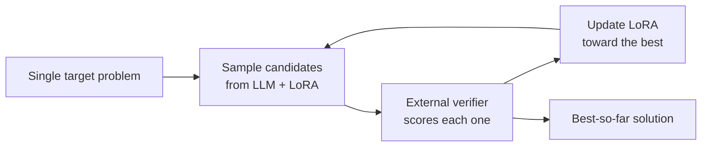

# Paper overview note: format

## Who reads it

Anton reads this note **before** the paper, in 3–5 minutes, to get the intuition and decide
whether to read further. He is an ML engineer and knows the basics. He reads papers to
extend his knowledge, so the note must teach the idea, not summarise the paper's details.

- **Length:** about 600–900 words of body. If it would take longer than 5 minutes to read,
  it is too long.
- **Test every sentence:** would Anton understand it without having read the paper? If
  not, explain it in plain words or cut it. A note that needs the paper to be understood
  has failed.
- **Intuition first, always.** Plain language, an analogy or a small picture before any
  term. Details are for the paper and for `notes/<stem>.md`, not this note.

The note is about one paper. The general approach or field goes in concept notes, which
this note links to. It must render well in Obsidian and VS Code.

## What makes a good overview

Anton's verdicts on earlier drafts:
- ChatGPT's were clear and well structured, but repetitive and shallow.
- Claude's had the depth and nuance, but were dense and harder to read.
- Claude's 2026-09-30 note for "Learning to Discover at Test Time" failed. It was about 4×
  too long, full of hyperparameters, provider names, costs, numbers and page references,
  and too technical to read before the paper.

Aim for a clear structure and real insight, in few words:

- **One angle per section, each fact once.** The abstract callout is the only summary.
- **Concrete means plain mechanism, not implementation detail.** "The model writes code, a
  checker scores it, and the model is nudged toward its best attempts", not "sample 512
  rollouts from gpt-oss-120b with a rank-32 LoRA adapter on Tinker".
- **Numbers: default to none.** Keep a number only if the note would be worse without it,
  and then give its baseline ("about 2× faster than the best human kernel"). Never include
  hyperparameters, batch sizes, ranks, step counts, costs, API or provider names, or exact
  scores. A model name only when the model itself is the point (e.g. "works with an open
  model, where prior results needed closed ones").
- **No page, table, figure or equation references.** They pull the note toward detail; the
  paper is there for that.
- **No unexplained names.** Every method or benchmark gets a link or a few plain words at
  first use.
- **Answer questions; don't raise them.** A reader shouldn't finish a sentence with a new
  question. If a term would puzzle someone new to the area, unpack it in place or leave it
  out.
- **Say why, not only what.** Tie each design choice to the problem it solves, in words.
- **Background only where needed**, and no overview of the field.
- **Claims come from the paper.** Anything from general knowledge is marked "(not from the
  paper)".
- **Plain, readable prose.** Short paragraphs, bold lead-ins, bullets where items are
  parallel. No `---` separators.

### Math

Anton likes maths but remembers intuition, not formulas. Use at most one small formula, and
only when it makes the idea click. Write it in reduced notation, then say in one sentence
what it means. No numeric worked examples. Usually words are enough: "the loss
exponentially up-weights the best attempts, so the model learns mostly from its rare
successes".

### Diagrams

Use a mermaid `flowchart LR` when the method is a loop or a pipeline: 4–5 nodes with
two-line labels (`<br/>`), so it renders wide. Describe steps, not applications. Don't try
to verify the rendering; Anton will say if it needs redrawing.



## Frontmatter

Every field name is one word. Use this order:

```yaml
---
title: "Learning to Discover at Test Time"
aliases: [TTT-Discover]
authors: [Mert Yuksekgonul, <author 2>, <author 3>, <author 4>, <author 5>, et al.]
affiliations: [Stanford, NVIDIA, Together AI]
year: 2026
type: method
topic: llm/agents
links:
  - https://arxiv.org/abs/2601.16175
  - https://github.com/test-time-training/discover
concepts: ["[[Test-time training]]", "[[Risk-sensitive RL]]", "[[Test-time compute scaling]]"]
papers: ["[[AlphaEvolve A coding agent for scientific and algorithmic discovery]]"]
tags: [lora, gpt-oss, gpu-kernels, combinatorics]
read: false
analyzed: false
queued: false
revisit: false
reproduce: false
---
```

- `title`: the exact paper title, copied from the library frontmatter. Don't add the method
  name in brackets; that goes in `aliases`.
- `aliases`: the method's or paper's short name, if it has one. Otherwise leave the field
  out.
- `authors`: all of them if there are 6 or fewer, otherwise the first 5 followed by
  `et al.`.
- `affiliations`: only if the paper states them. Short names, deduplicated.
- `year`: from `published`.
- `type`: the same value as in the library frontmatter (see the table below).
- `topic`: the paper's library folder path.
- `links`: a plain list of URLs: the arXiv page and the code or project URLs printed in
  the paper.
- `concepts`: 3–6 links to the ideas the paper is *about*, not tools it merely uses.
- `papers`: links to the 2–5 closest papers. For a paper in the library, link its stem.
  Otherwise use its short common name, or the name of an existing vault note for it.
- `tags`: lowercase and hyphenated: the specific tools, models, datasets and domains the
  paper touches, so an agent can search for them. The frontmatter is the place for these
  details, not the body. Never `paper`, never something every note would carry, never
  vague umbrellas (`ai-for-science`), and nothing already in `concepts`.
- The checkboxes all start `false`; Anton sets them.

## Body

No H1, because Obsidian shows the file name. It starts with the callout:

```markdown
> [!abstract]
> <1–2 plain sentences, written for Anton: the problem and the idea>
```

Write the callout fresh. Don't copy the library `summary`, which is written for agents.
No method name (it's in the title and aliases), no model names, no jargon. Example: "An LLM
keeps learning while it works on one hard problem, training on its own best attempts
instead of staying frozen, to find a single solution better than anything known."

Then come three `##` sections. Anton adds his own `##` sections later.

- `## Overview`, with the `###` subsections for the paper's type (next table). Keep every
  subsection of the type; if the paper gives nothing for one, say so in one line.
- `## Questions`: 3–5 conceptual questions that deepen understanding: what exactly is
  updated, why this works, where it would break, how it compares to X. No numbers, no audit
  of the experiments.
- `## Follow-ups`, with two bold-led lists, no checkboxes.
  - **Read**: 2–4 papers or concepts, each with a few words on why. Closest work first.
    Mark papers already in the library.
  - **Try**: 1–2 simple hands-on ideas for building intuition, such as running the repo's
    simplest example or a small toy notebook. No parameter choices. Leave the list out if
    nothing practical applies.

### Sections by type

Every type follows the same length and plainness rules. Each subsection is a few sentences
or a short list.

These names mean the same in every type:
- **Setting**: 1–3 sentences in plain words on which kind of problem the paper targets and
  where it doesn't apply. No reward definitions or formulas.
- **Evidence**: 2–4 short bullets on how solid the claims are: external validation, fair
  baselines, ablations, what is missing. No tables.
- **Novelty**: 3–5 one-line bullets of the form "vs [[X]]: the difference", from the paper's
  own related work, concurrent work marked. Optionally one line on the broader trend the
  paper names.
- **Concepts**: always last. Prerequisites as a link plus a one-line plain gloss, no
  formulas. Skip what Anton clearly knows (LoRA, transformers, anything with a concept note
  in the vault).

| Type | The paper… | `###` subsections of Overview, in order |
|---|---|---|
| `method` | proposes a technique, model or algorithm | Setting · Motivation · Method · Why it works · Applications and results · Evidence · Novelty · Concepts |
| `survey` | reviews a field | Scope · Taxonomy · Findings · Open problems · Coverage · Concepts |
| `benchmark` | introduces a dataset or evaluation | Setting · Construction · Findings · Validity · Novelty · Concepts |
| `study` | analyses existing methods empirically, with no new method | Question · Design · Findings · Caveats · Novelty · Concepts |
| `system` | is a technical report or system paper: a whole model or product | Setting · Architecture · Recipe · Results · Novelty · Evidence · Concepts |
| `position` | argues a view | Claim · Arguments · Counterarguments · Implications · Novelty · Concepts |
| `theory` | proves results | Setting · Result · Proof idea · Implications · Novelty · Concepts |

For a mixed paper, use the main type and add one subsection for the other part.

#### method

- **Motivation**: one short paragraph on what existing approaches do and where they fall
  short, with links, then the key insight in one line. Level wanted: "Best-of-N treats
  every attempt as independent: if attempt #37 was a near-miracle, attempt #38 learns
  nothing from it."
- **Method**: 4–6 plain numbered steps and the diagram. The mechanism only; the reasons go
  in the next subsection.
- **Why it works**: the most important section. One bold-led item per key idea, 2–3
  sentences each, intuition or analogy first, saying which problem it solves. Written for
  understanding, not completeness.
- **Applications and results**: a table with the domain, the task in plain words (what
  was being solved, in half a sentence), and a qualitative outcome ("beat the best human
  submission", "matched the known best, no gain"). At most one number per row, with its
  baseline.

#### survey

- **Scope**: what is covered, and roughly when the literature stops.
- **Taxonomy**: the organising axes as a short nested list, with the key methods linked.
- **Findings**: what the field agrees on and the main trade-offs.
- **Open problems**: as the authors state them.
- **Coverage**: what is missing or stale; general knowledge is marked "(not from the
  paper)".

#### benchmark

- **Setting**: the capability it measures and why existing benchmarks fall short.
- **Construction**: where the data comes from, the task format, and the metric, in words.
- **Findings**: how current models do and where they fail.
- **Validity**: contamination, label quality, saturation.

#### study

- **Question**: what it asks and why that is open.
- **Design**: what is compared and what is held fixed.
- **Findings**: one bold-led claim per item.
- **Caveats**: confounds and how far the findings generalise.

#### system

- **Architecture**: the components and how they connect, with a diagram.
- **Recipe**: the choices the report says mattered, not the full training setup.
- **Results**: as in `method`.

#### position

- **Claim**: the thesis in one or two sentences.
- **Arguments** and **Counterarguments**: the main ones, the latter marked "(not from the
  paper)" when added.
- **Implications**: what would change if the claim is right.

#### theory

- **Setting**: the problem and any restrictive assumption.
- **Result**: the main theorem in plain words.
- **Proof idea**: the key trick in a sentence or two.
- **Implications**: what it explains in practice.

## Links

- Use Obsidian links (`[[Name]]`) for concepts and papers, in the frontmatter and the body.
  For a long paper stem in the body, add a display name:
  `[[AlphaEvolve A coding agent for scientific and algorithmic discovery|AlphaEvolve]]`.
- Linking to notes that don't exist yet is encouraged. Pick a natural, singular name
  ("Risk-sensitive RL", "PUCT"). Don't normalise names across the vault.
- No "My thoughts" section, placeholders, or to-do checkboxes.
