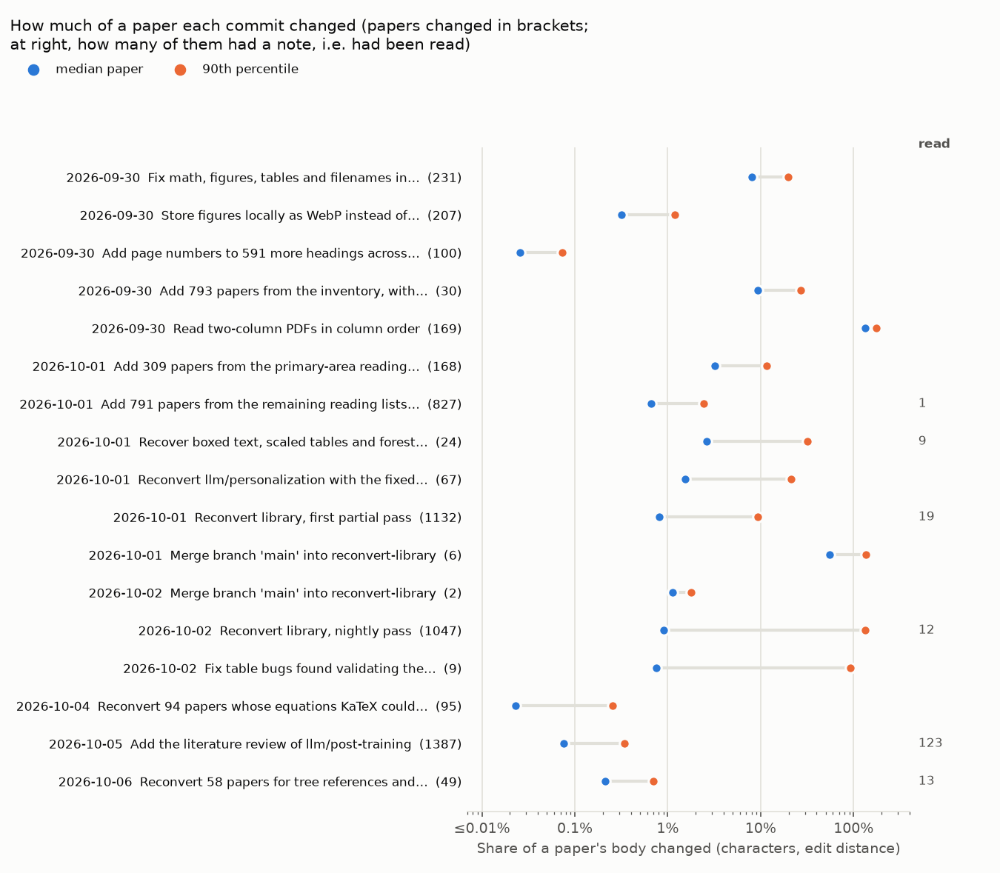

# Experiment · how much do papers change after they are read?

**Question.** A note is written from a paper's markdown. When the converter improves and the paper is reconverted, or a paper is fixed by hand, the note may describe a text that no longer exists. Should a note be read again whenever its paper changes, or only when a change matters?

**Status.** Measured 6 Oct 2026 on the git history of the author's library (64 commits on main, 29 Sep to 6 Oct). A third of the papers ever read changed after their note was written, but since the converter settled on 3 Oct a change has touched a median 0.08% of the paper and 90% of changes under 0.4%; the one large change was a repeated author block collapsed. Notes are not re-read when their paper changes; only papers whose key content was broken are, once fixed.

**Serves.** [`docs/design.md`](../../docs/design.md#decisions-log), and the `fix-conversions` skill.

## Method

- **Library.** The author's, at commit `ed802c10` (6 Oct 2026): 2,204 papers, 432 of which have ever had a note.
- **Changes.** [`measure.py`](measure.py) walks the first-parent history of main, oldest first, so a merge counts once, as the change it brings. For every commit and every paper whose body changed (frontmatter left out; papers added, deleted or only moved left out) it records the lines changed (the longer side of each block that differs) and the characters changed (edit distance over those blocks, with rapidfuzz), and the share of the body that is.
- **Read.** A paper counts as read from the commit that added its note, followed through renames. A change is "after reading" when the note was added in an earlier commit.
- **Limits.** Size is not importance: a 300-character table restored in a 60K-character paper is 0.5%, and may be exactly what a note lacked. The share can exceed 100% when a paper is rewritten (edit distance counts both what is removed and what is added). One commit, "Add the literature review of llm/post-training" (5 Oct), also carried converter fixes applied to 1,387 papers (proof headings, empty table cells, icon names), which is why a review commit appears as a pass.
- **Apparatus.** `python3 measure.py <library> changes.tsv` (about 10 minutes for 64 commits), then `python3 summarize.py changes.tsv notes-born.tsv`.
- **Results.** [`changes.tsv`](changes.tsv) (5,550 changes: commit, paper, body size, lines and characters changed, whether it had been read), [`notes-born.tsv`](notes-born.tsv), [`passes.tsv`](passes.tsv) (per commit), [`after-reading.txt`](after-reading.txt), [`passes.png`](passes.png).

## Results

### Per commit

The large rewrites (two-column PDFs read in column order on 30 Sep, the nightly reconversion pass on 2 Oct, whose 90th percentile is a rewritten paper) came before most notes existed. The passes since have changed a tenth of a percent of a typical paper: the KaTeX fixes of 4 Oct a median 0.02%, the converter fixes of 5 Oct 0.08%, the tree references of 6 Oct 0.2%.

### Papers that had been read

| | Value |
|---|---|
| Papers ever read | 432 |
| Changed after their note was written | 143 (33%) |
| Times changed after reading | mean 1.24, max 3 (113 once, 26 twice, 4 three times) |

| Changes after reading | Changes | Lines, median / max | Characters, median / mean / max | Share of the body, median / 90th pct / max | Over 1% |
|---|--:|--:|--:|--:|--:|
| Before 3 Oct (converter rebuilt) | 41 | 30 / 902 | 606 / 5,904 / 84,023 | 0.78% / 7.8% / 153% | 19 |
| From 3 Oct | 136 | 8 / 274 | 91 / 1,230 / 128,517 | 0.08% / 0.37% / 38% | 7 |

- The largest change before 3 Oct was MemGPT, rewritten by the converter fixes of 1 Oct (153%); the next were three memory papers reconverted in the first library pass (24–36%).
- The largest since 3 Oct, Terminal-Bench (38%, 92 lines), was its author block: the same affiliation line repeated for each author, collapsed into one. The paper's content did not change.

## Conclusions

1. Re-reading a note whenever its paper changes would re-read a third of the read papers for changes that are almost all a fraction of a percent. Since the converter settled it would have re-read 132 papers, at about 56K cost-eq each, for a median of 91 changed characters.
2. What decides whether a note is wrong is not the size of the change but whether the paper's key content was broken when it was read. The reader now says so in the note (`key-content-broken`); those papers are fixed and read again, and the others keep their notes.
3. A fingerprint of the text each note was read from, with stale notes listed for re-reading, was built and removed the same day: it answered a question these numbers show is rarely worth asking.
4. Run `measure.py` again after the next large converter change. If a pass changes read papers by more than a few percent, look at those papers' notes.
