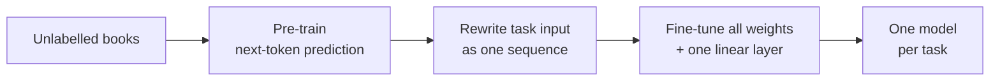

> [!abstract]
> Teach one model language by having it predict the next word in books, then adapt that same model to every task with little labelled data.

## Overview

### Setting

Language understanding tasks (does this sentence follow from that one, which story ending makes sense, are these two questions the same) where **labelled data is scarce** but unlabelled text is plentiful, and success means beating models hand-built for each task.

### Motivation

In 2018, transfer from unlabelled text in NLP mostly meant word vectors. Richer approaches either fed a pretrained model's features into a new task-specific network ([[Deep contextualized word representations|ELMo]]), adding many new parameters per task, or fine-tuned an LSTM language model ([[ULMFiT]]), which remembers only short spans of text and was tried mostly on classification.

**Key insight:** if the pretrained model is a Transformer and every task is rewritten as a plain sequence of text, the *whole* network can be transferred and nothing task-specific needs to be built on top.

### Method

Two stages on one network, a decoder-only Transformer (the model reads text left to right):

1. **Pre-train** it to predict the next token on a large corpus of unpublished books.
2. **Rewrite** each task's input as one token sequence, with special start, delimiter and end tokens.
3. **Add** a single linear layer that maps the final token's state to the task's labels.
4. **Fine-tune** all weights on the labelled task, keeping next-token prediction as a side loss.

### Why it works

- **Generative pre-training** ([[Language modeling]]): to predict the next word well, the model must pick up grammar, meaning and some world knowledge, which every downstream task needs. Without it, the same network loses badly on every task.
- **Transformer instead of LSTM**: attention can look back over the whole context, so the model learns longer-range structure. An LSTM trained the same way does clearly worse.
- **Task-aware input transformations**: entailment becomes "premise, delimiter, hypothesis"; multiple choice becomes one sequence per answer, scored and compared. The model only ever sees text, so no new architecture has to be learned from scratch on a small dataset.
- **Long contiguous training text**: books keep paragraphs and chapters intact, unlike sentence-shuffled corpora, so the model learns to use long context.

### Applications and results

| Domain | Task | Outcome |
|---|---|---|
| Commonsense reasoning | Pick the right ending of a short story | Large jump over the best prior model |
| Reading comprehension | Answer school-exam questions about a passage | Beat ensembles of task-specific models |
| Natural language inference | Decide if one sentence follows from another | Best on four of five datasets; lost on the smallest |
| Similarity and classification | Paraphrase detection, sentiment, grammaticality | Best on most; large gain on grammaticality |

Overall it set a new state of the art on 9 of the 12 datasets.

### Evidence

- **Clean ablations:** no pre-training, LSTM instead of Transformer, and no side loss, each on the same eight tasks.
- **Layer transfer:** each extra pretrained layer copied over improves results, so every layer holds something useful.
- **Mixed side-loss result:** keeping next-token prediction during fine-tuning helps large datasets and hurts small ones; on average it barely matters.
- **Limits:** one model size, no released code or weights in the paper, single runs, and a loss on the smallest entailment dataset.

### Novelty

- vs [[Deep contextualized word representations|ELMo]]: transfers the whole network and fine-tunes it, instead of feeding frozen features to a new task model.
- vs [[ULMFiT]] and earlier LSTM language-model fine-tuning: a Transformer for longer context, tested on a far wider range of tasks.
- vs auxiliary-objective methods: next-token prediction is the main training, not a side loss added to the target task.
- Early signal of the later trend: the pretrained model already solves some tasks with no fine-tuning, and gets better at them as pre-training continues.

### Concepts

- [[Transfer learning]]: train on one large problem, then reuse the learned network on smaller ones.
- [[Fine-tuning]]: continue training the pretrained weights on the target task's labels.
- [[Zero-shot learning]]: solving a task with no task-specific training, here by reading the model's word probabilities.
- [[Byte-pair encoding]]: splits text into frequent sub-word pieces, so rare words still get tokens.

## Questions

- Why does next-word prediction teach skills like entailment that the model never saw labelled?
- How much of the gain is the Transformer and how much the long book text?
- Why would a side language-modeling loss hurt small datasets?
- Would a model that reads in both directions transfer better, and what would it give up?
- How far could the zero-shot heuristics go with more scale alone?

## Follow-ups

**Read**
- [[BERT. Pre-training of Deep Bidirectional Transformers for Language Understanding|BERT]] (in library): same recipe with a bidirectional model, months later.
- [[Language Models are Unsupervised Multitask Learners|GPT-2]] (in library): the same model scaled up, dropping fine-tuning for zero-shot.
- [[Deep contextualized word representations|ELMo]] (in library): the feature-based baseline this paper argues against.
- [[ULMFiT]]: the closest prior LSTM version of pre-train-then-fine-tune.

**Try**
- Fine-tune a small pretrained decoder on an entailment dataset by joining premise and hypothesis with a delimiter token.
- Score a sentiment example zero-shot by comparing the model's probability of "positive" and "negative" after the text.
