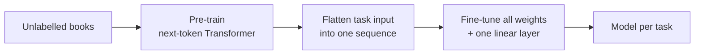

> [!abstract]
> Teach one model to predict the next word on lots of books, then lightly retrain it for each language task.

## Overview

### Setting

Language understanding tasks (does sentence A imply sentence B, are two questions paraphrases, which answer fits this passage) where **labelled examples are scarce** but raw text is plentiful. Success means one model that beats hand-designed, per-task models across many such tasks.

### Motivation

Pre-trained word vectors already showed that unlabelled text helps, but they only carry knowledge about single words. Attempts to transfer more than that disagreed on the training goal and needed task-specific machinery on top: [[ELMo]] feeds its representations into a new architecture per task, and [[ULMFiT]] fine-tunes a language model but uses an LSTM with a short reach.

**Key insight:** a language model with enough capacity, trained on long connected text, has to learn grammar, meaning and some reasoning just to predict the next word, so the whole network can be reused, not only its word vectors.

### Method

Two stages, with the network left unchanged between them:

1. **Pre-train** a left-to-right Transformer to predict the next token on thousands of unpublished books.
2. **Flatten** each task's input into one token sequence with special start, separator and end tokens (premise, separator, hypothesis).
3. **Add** a single linear layer that reads the model's last state and predicts the label.
4. **Fine-tune** all weights on the labelled task, keeping next-token prediction as a side loss.
5. **Combine** sequences for multi-part tasks: for multiple choice, run one sequence per answer and pick by a softmax over them.

### Why it works

- **Generative pre-training** ([[Language modeling]]): predicting the next word on varied text forces the model to learn knowledge many tasks share, so the labelled data only has to steer it.
- **Transformer instead of LSTM**: attention can look back over the whole context, so the model picks up long-range structure that recurrent models lose; it also transfers more stably.
- **Contiguous book text**: long unshuffled passages give the model something long-range to learn, unlike sentence-shuffled corpora.
- **Task-aware input transformations**: turning structured inputs into plain sequences means almost no new parameters per task, so nearly everything is transferred instead of trained from scratch.
- **Auxiliary language-modelling loss**: keeps the model a good predictor of text while fine-tuning; it helps on large datasets and not on small ones.

### Applications and results

| Domain | Task | Outcome |
|---|---|---|
| Inference | Does one sentence follow from another | Beat prior best on 4 of 5 datasets; lost on the smallest |
| Question answering | Pick the answer to exam questions about a passage | Clear gain over ensembles of task-specific models |
| Commonsense | Choose the right ending of a short story | Largest gain in the paper |
| Similarity | Are two sentences or questions paraphrases | Best on 2 of 3 datasets |
| Classification | Grammaticality and sentiment | Big jump on grammaticality; on par for sentiment |

### Evidence

- **Broad comparison:** 12 datasets across four task families, against published task-specific models and ensembles; best on 9.
- **Ablations:** removing pre-training costs a lot on every task; swapping the Transformer for an LSTM costs a fair amount.
- **Zero-shot probes:** the raw language model, with no fine-tuning, gets steadily better at these tasks as pre-training goes on.
- **Limits:** one model size, one run per setting; weak on a small inference dataset; prior bests are quoted from papers, not rerun.

### Novelty

- vs [[ELMo]]: transfers the whole network and fine-tunes it, instead of feeding frozen features into a new per-task model.
- vs [[ULMFiT]] and Dai & Le: same pre-train-then-fine-tune idea, but with a Transformer and on many more task types than text classification.
- vs auxiliary-objective methods: a side language-modelling loss is used, but pre-training does most of the work.
- Trend the paper names: unsupervised pre-training as a regulariser and starting point, now made to work for whole sentences rather than word vectors.

### Concepts

- [[Generative pre-training]]: train on the unlabelled data's own structure (next token) before the real task.
- [[Transfer learning in NLP]]: reuse what one training run learned to start another task.
- [[Zero-shot evaluation]]: solving a task with the pre-trained model alone, by scoring candidate answers by their likelihood.

## Questions

- Why does next-token prediction teach skills useful for classification at all?
- Why does the side language-modelling loss help large datasets but not small ones?
- What would change with a model that reads both left and right context?
- How much of the gain comes from the Transformer versus the book corpus?
- When does fine-tuning all weights beat prompting the frozen model?

## Follow-ups

**Read**
- [[Language Models are Unsupervised Multitask Learners|GPT-2]] (in library): drops fine-tuning, turns the zero-shot probes into the main method.
- [[BERT]]: same recipe with a bidirectional model, which soon beat this one (not from the paper).
- [[ELMo]]: the feature-based alternative this paper argues against.
- [[Language Models are Few-Shot Learners|GPT-3]] (in library): replaces per-task fine-tuning with examples in the prompt.

**Try**
- Load a small pre-trained GPT-style model and fine-tune it on a sentiment dataset, with and without the pre-trained weights.
- Reproduce the zero-shot sentiment trick: append "very" and compare the probabilities of "positive" and "negative".
