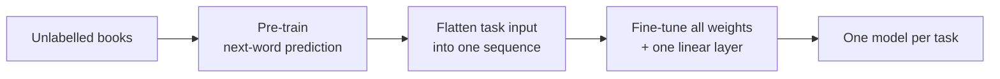

> [!abstract]
> Teach a model language by having it predict the next word in thousands of books, then lightly retrain it for each task.

## Overview

### Setting

Language understanding tasks (does sentence B follow from A, are two questions the same, which answer fits this passage) where **labelled data is scarce but raw text is everywhere**. Success means one model that does well on all of them without a custom design for each.

### Motivation

By 2018, pre-trained word vectors ([[Word2vec]], GloVe) were standard, but they carry only word-level meaning. Richer transfer existed: [[Deep contextualized word representations|ELMo]] feeds a language model's hidden states into a separate task model, and [[ULMFiT]] fine-tunes a pre-trained LSTM. Both still need either new task-specific layers or a recurrent model that forgets long context.

**Key insight:** if a model must predict the next word in long, coherent text, it has to learn grammar, meaning and some reasoning along the way, and that knowledge can be reused almost as-is.

### Method

Two stages, with almost nothing added between them:

1. **Pre-train** a Transformer to predict the next token on a large corpus of unpublished books.
2. **Flatten** each task's input into one token sequence: premise, delimiter, hypothesis; or passage, question, delimiter, candidate answer.
3. **Add** a single linear layer on top of the final token's representation to predict the label.
4. **Fine-tune** the whole network on the labelled data, keeping next-word prediction as a side loss.
5. **Score** multiple-choice tasks by running each candidate as its own sequence and picking the best.

### Why it works

- **Transformer instead of LSTM:** attention can look back over the whole context, so long-range structure learned in pre-training survives transfer; swapping in an LSTM costs a clear drop.
- **Long contiguous text** ([[BooksCorpus]]): whole books, not shuffled sentences, so the model must track a story across paragraphs, which is what reading-comprehension tasks need.
- **Traversal-style input transformations:** turning pairs and triples into one string lets the pre-trained network be reused unchanged, instead of bolting on new untrained modules that learn from scratch.
- **Auxiliary language-modelling loss:** keeps predicting the next word during fine-tuning, which speeds convergence and helps on the larger datasets (it slightly hurts the small ones).

### Applications and results

| Domain | Task | Outcome |
|---|---|---|
| Commonsense reasoning | Pick the right ending of a short story | Large gain over the previous best |
| Reading comprehension | Answer school-exam questions about a passage | Beat ensembles of task-specific models |
| Entailment | Decide whether one sentence follows from another | Best on four of five datasets; lost on the smallest |
| Similarity and paraphrase | Are two sentences or questions the same | Best on two of three |
| Classification | Grammaticality and sentiment | Big jump on grammaticality; on par for sentiment |
| Benchmark suite | [[GLUE]] overall | New best score |

### Evidence

- **Broad:** 12 datasets across four task types, state of the art on 9 of them, often against ensembles.
- **Ablations:** removing pre-training collapses performance across every task; each additional transferred layer helps.
- **Zero-shot hints:** without any fine-tuning, simple prompting-style tricks (compare the probabilities of "positive" and "negative") improve steadily as pre-training goes on.
- **Thin:** one model size, one run per setting, no variance reported, and no code or weights in the paper.

### Novelty

- vs [[Deep contextualized word representations|ELMo]]: fine-tunes the whole model rather than feeding frozen features into a new task architecture.
- vs [[ULMFiT]] and earlier LSTM pre-training (Dai & Le): a Transformer instead of an LSTM, and tested on far more task types than text classification.
- vs task-specific architectures: one network for all tasks; only the input format changes.
- Broader trend: unsupervised pre-training as initialisation, an old idea from vision and speech, finally made to pay off in NLP.

### Concepts

- [[Language modeling]]: predicting the next token from the previous ones; needs no labels.
- [[Transfer learning]]: reuse what a model learned on one problem as the starting point for another.
- [[Byte-pair encoding]]: splits rare words into frequent sub-word pieces so the vocabulary stays small.
- [[GLUE]]: a suite of nine sentence-understanding tasks with one combined score.

## Questions

- Why does next-word prediction teach entailment or paraphrase at all?
- Why would the auxiliary loss help large datasets but hurt small ones?
- What does the model lose by seeing only left context, compared with BERT?
- Is fine-tuning needed, or was the zero-shot signal already the real story?
- How much of the gain comes from BooksCorpus's long documents versus the architecture?

## Follow-ups

**Read**
- [[Language Models are Unsupervised Multitask Learners|GPT-2]] (in library): same recipe scaled up, dropping fine-tuning for zero-shot prompts.
- [[BERT. Pre-training of Deep Bidirectional Transformers for Language Understanding|BERT]] (in library): the bidirectional answer, months later, that overtook it on GLUE.
- [[Deep contextualized word representations|ELMo]] (in library): the feature-based alternative it argues against.
- [[ULMFiT]]: the LSTM fine-tuning approach closest to this one.

**Try**
- Load the small GPT-2 checkpoint and reproduce the sentiment trick: append "very" and compare the probabilities of "positive" and "negative".
