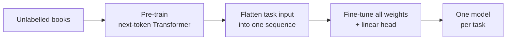

> [!abstract]
> Teach one Transformer to predict the next word on lots of books, then lightly retrain it for each language task.

## Overview

### Setting

Language understanding tasks (does sentence B follow from A, are two questions the same, which story ending is right) where **labelled examples are scarce** but raw text is plentiful. Success means one general model beating architectures hand-built for each task.

### Motivation

Before this, unlabelled text mostly helped through word embeddings, which capture single words, not sentences or discourse. Richer transfer existed ([[ELMo]], [[ULMFiT]]), but it either bolted the pre-trained features onto a new task-specific network or used LSTMs that see only short context. Nobody agreed on which training objective or which transfer method to use.

**Key insight:** to predict the next word in a long story, a model has to track who did what and why, so plain next-word prediction on long, contiguous text already teaches much of what the downstream tasks need.

### Method

Two stages, and the network barely changes between them:

1. **Pre-train** a decoder-only Transformer to predict the next token on a corpus of unpublished books.
2. **Flatten** each task's structured input into one token sequence: premise, delimiter, hypothesis; or document, question, delimiter, candidate answer.
3. **Add** a single linear layer on top of the last token's representation to predict the label.
4. **Fine-tune** all weights on the labelled task, keeping next-word prediction as a side objective.
5. **Score** multiple-choice tasks by running each candidate answer as its own sequence and picking the highest.

### Why it works

- **Generative pre-training on long contiguous text:** books keep whole stories intact, unlike sentence-shuffled corpora, so the model learns long-range dependencies that reasoning tasks need.
- **Transformer instead of LSTM:** attention gives a more structured memory over long context; the same framework with an LSTM transfers clearly worse.
- **Traversal-style input transformations:** turning pairs and triples into one sequence lets the pre-trained network process them as ordinary text, so almost nothing new has to be learned from scratch.
- **Auxiliary language-modelling loss during fine-tuning:** keeps the model close to what it learned in pre-training; it helps on the larger datasets but not on the small ones.

### Applications and results

| Domain | Task | Outcome |
|---|---|---|
| Commonsense reasoning | Pick the right ending to a short story | Big jump over the best prior system |
| Reading comprehension | Answer school-exam questions about a passage | Beat ensembles of task-specific models |
| Entailment | Judge whether one sentence follows from another | Best on four of five datasets; lost on the smallest one |
| Paraphrase and similarity | Decide if two sentences mean the same | Best on two of three |
| Classification | Grammaticality and sentiment of a sentence | Large gain on grammaticality; on par for sentiment |
| Overall | Mixed benchmark of nine tasks (GLUE) | New best average score |

### Evidence

- **Broad comparison:** twelve datasets across four task families, state of the art on nine, often against ensembles.
- **Ablations:** removing pre-training costs about 15 points of average score; swapping in an LSTM costs about 6.
- **Zero-shot probes:** simple prompts on the untuned model improve steadily as pre-training goes on, a hint that the model learns tasks as a side effect.
- **Thin in places:** one model size, single runs, no variance; the side objective's benefit is mixed in the paper's own ablation.

### Novelty

- vs [[Word embeddings]]: transfers a whole deep network, not just word vectors.
- vs [[ELMo]]: fine-tunes the pre-trained model itself rather than feeding its features into a new task network.
- vs [[ULMFiT]] and Dai & Le's LSTM pre-training: Transformer for longer context, and tested far beyond text classification.
- vs auxiliary-objective methods: the language-model loss is mainly a pre-training stage, not only an add-on to the task loss.

### Concepts

- [[Generative pre-training]]: train on next-token prediction over unlabelled text to get a general starting point.
- [[Fine-tuning]]: continue training all pre-trained weights on a small labelled task.
- [[GLUE]]: a suite of sentence-level understanding tasks with one combined score.

## Questions

- Why does next-word prediction teach entailment or paraphrase detection at all?
- Why did the side language-modelling loss help large datasets but hurt small ones?
- Why did a decoder-only model lose to bidirectional encoders soon after (not from the paper)?
- Which part of the gain comes from the data being books rather than from the Transformer?

## Follow-ups

**Read**
- [[Language Models are Unsupervised Multitask Learners|GPT-2]] (in library): same recipe scaled up, tasks posed as text with no fine-tuning.
- [[BERT]]: the bidirectional successor that overtook it months later (not from the paper).
- [[ULMFiT]]: closest prior work, LSTM pre-train then fine-tune for classification.
- [[Language Models are Few-Shot Learners|GPT-3]] (in library): replaces fine-tuning with examples in the prompt.

**Try**
- Fine-tune a small pre-trained GPT-style model on an entailment dataset using the delimiter trick, and compare with the same model trained from scratch.
